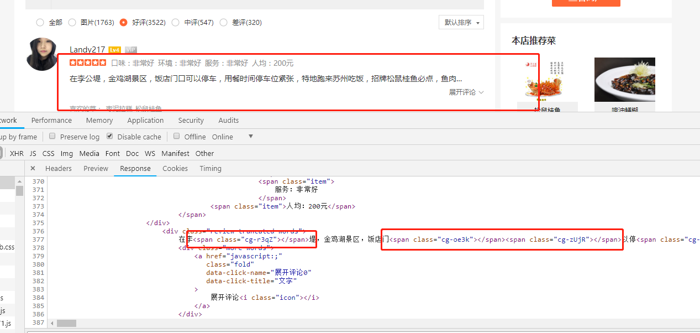
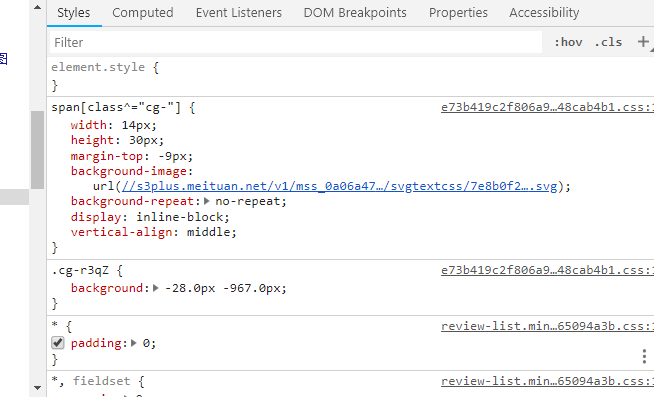
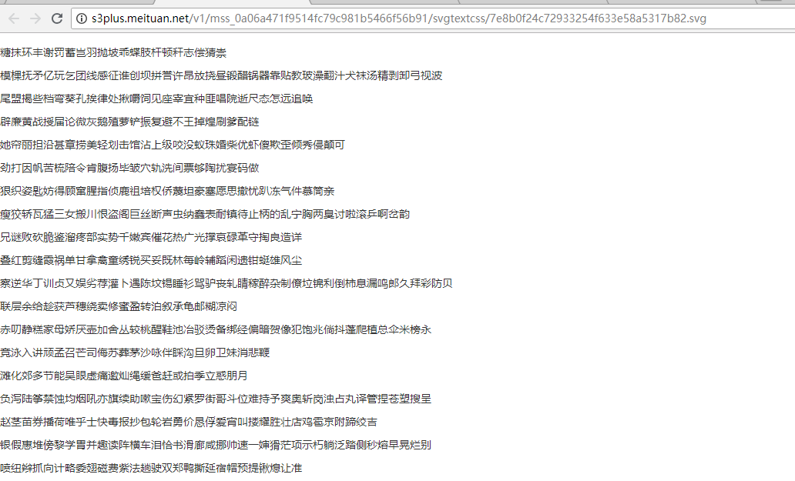
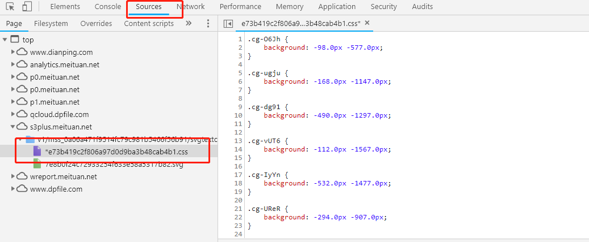

###		大众点评评论爬虫（字体反爬）

​	记一次爬取大众点评评论的经历，本来是打算爬取好评和差评做一下情感分析。但是发现大众点评是有一个字体反爬的措施，所以单独写一个教程出来。

​	要爬取的测试连接：http://www.dianping.com/shop/2044996/review_all/p1?queryType=reviewGrade&queryVal=good

​	首先，我们浏览器抓包，看一下页面信息是否能够正常获取，有没有ajax异步请求。然后我们发现数据是正常获取的，但是有些文字被span标签给替换掉了。

​	基本可以判断，大众点评是用span标签替换了某些文字，达到反爬的效果。span标签中class名应该是对应着相应的汉字。审查元素看一下span标签的属性，



​	有一个**background-image** 的属性，用背景图片填充了文字。我们看到的页面是正常的，但是爬下来的评论，有些文字会变成span标签。url有指向一个svg文件，我们可以看一下。

​	

​	svg文件其实是一个矢量图来着，所有span标签替换的字体应该都在这里了。怎么能把span标签和文字一一对应呢，现在还不清楚，我们推测它这个span标签的class名会不会是js生成的呢，我们可以去看一下它的静态资源，切换到评论页面，在浏览器**Sources**一栏中，一个个的去看。然后我们发现一个css文件中，有对应的class名。



​	这个**background**属性看起来就很像坐标了，能不能对应起来呢，我们需要测试一下。首先我们要测一下svg文件中字体，空行占的像素。我没有现成测像素的工具，找的前端同事用ps给我测的。注意一点，svg文件头中有标识**width="600px"** ，**height="2520.0px"** ，所以用ps打开也要用这个尺寸。

​	过程就不细说了，字体是14px，空行16px，上边距7px，原点为页面左上角，左边数字为x轴，右边数字为y轴。

​	在第一个图中，“公”字对应的span标签为`<span class="cg-r3qZ"></span>`，我们在css文件中找到**.cg-r3qZ**的记录，

```css
.cg-r3qZ {
    background: -28.0px -967.0px;
}
```

​	一个字符14px，28/14=2，所以应该是在左起第3个汉字。再看看在哪一行，上边距7px，字符14px，空行16px，（967-7）/30=32，所以应该是在第33行，第3个字。


​	说明我们找的没问题。问题到这里基本上解决了，只要我们把页面爬下来之后，用对应汉字替换span标签就可以了，完美。

​	对了，大众点评爬虫会封ip哦，记得用代理去爬。我们先把svg文件中的文字爬下来，然后建一个二维数组，写在settings里。Headers，Cookies，user-agent池和代理ip池也一起放到settings文件里。代理ip我自己爬的，能不能用要自己测试一下哈，页面是http的，所以代理也只能是http的不能是https的。

**settings.py**

```python
Cookies = {
    '_lxsdk_cuid': '166c37a682dc8-042321d0838827-47e1137-1fa400-166c37a682dc8',
    '_lxsdk': '166c37a682dc8-042321d0838827-47e1137-1fa400-166c37a682dc8',
    '_hc.v': '415529b3-db4c-fb1e-f35d-55de9dee387e.1540877871',
    'dper': '7b8c64d6c18583ebc5a6dc9e712a9345245cd9891e7a00c1fa36bf899170134aabc50ece9c325f630992dd5973935268fa43fe19c2a08c81108363711205e90d40abb25f909f3a033185c98a4d1c572d5f4d1b49646db08e962781a5a7abee2b',
    'll': '7fd06e815b796be3df069dec7836c3df',
    'ua': 'dpuser_3890708790',
    'ctu': 'fbd7a485fd6b33d17b7c46e9b069d2b917cc5b3ee11100f5d22568a180b43dca',
    '_lxsdk_s': '166c37a682f-666-4c0-793%7C%7C438',
}

Headers = {
    'Host': 'www.dianping.com',
    'Connection': 'keep-alive',
    'Pragma': 'no-cache',
    'Cache-Control': 'no-cache',
    'Upgrade-Insecure-Requests': '1',
    'User-Agent': 'Mozilla/5.0 (Windows NT 10.0; Win64; x64) AppleWebKit/537.36 (KHTML, like Gecko) Chrome/67.0.3396.87 Safari/537.36',
    'Accept': 'text/html,application/xhtml+xml,application/xml;q=0.9,image/webp,image/apng,*/*;q=0.8',
    'Accept-Encoding': 'gzip, deflate',
    'Accept-Language': 'zh,en-US;q=0.9,en;q=0.8,zh-TW;q=0.7,zh-CN;q=0.6',

}

Words_list = [
    ['筑', '脸', '倒', '趣', '族', '纯', '溜', '帽', '跌', '醒', '亚', '辞', '菜', '柄', '骤', '涝', '吃', '换', '打', '溉', '颈', '人', '稼',
     '稍', '鸦', '贴', '慌', '茶', '毫', '阶'],
    ['贺', '幻', '肉', '酬', '真', '捉', '名', '胶', '床', '身', '披', '买', '枣', '鸡', '罐', '辰', '刊', '缓', '在', '乳', '拔', '咸', '屠',
     '垦', '尝', '农', '黄', '县', '柜', '桨', '俩', '呢', '谱', '料', '僵', '昂', '答', '国', '侮', '陵'],
    ['娱', '宇', '场', '羽', '球', '副', '省', '青', '覆', '凝', '锦', '纲', '瓜', '棚', '代', '杰', '影', '盛', '膛', '陕', '纤', '侄', '拳',
     '如', '标', '直', '羊', '创', '费', '回', '领', '嫂', '预', '屡', '符', '苦', '绘', '空', '毒', '构', '妙'],
    ['盘', '桶', '棋', '经', '泻', '腹', '龄', '队', '枕', '慨', '穷', '泼', '病', '耻', '葱', '斩', '袭', '求', '无', '榜', '例', '蠢', '贪',
     '狡', '抓', '堡', '粘', '晌', '员', '潮'],
    ['当', '椅', '山', '浸', '环', '咏', '下', '傻', '摊', '秒', '棍', '喜', '唯', '主', '包', '态', '餐', '正', '歌', '怜', '清', '挤', '君',
     '测', '俘', '关', '抱', '挡'],
    ['讲', '丰', '此', '眼', '匹', '敲', '旨', '斧', '仓', '励', '涨', '塞', '即', '恒', '菌', '派', '勿', '库', '要', '出', '订'],
    ['搞', '橡', '酒', '盏', '滨', '血', '萍', '刻', '钟', '句', '凑', '寻', '寸', '糟', '糕', '抽', '盗', '莲', '轧', '忍', '终', '党', '匀',
     '蜓', '浑', '物', '落', '悄', '狐', '泽', '俯', '薯', '往', '含', '给', '比', '产', '茎', '膝'],
    ['闯', '锐', '赌', '塔', '剧', '撑', '叉', '暗', '燥', '爱', '腔', '完', '刷', '待', '淘', '裤', '陪', '阔', '议', '探', '试', '质', '们',
     '杏'],
    ['适', '威', '加', '题', '肢', '送', '皂', '菠', '悼', '丈', '久', '还', '瓶', '驳', '粗', '旺', '淹', '司', '养', '返', '科', '炉', '理',
     '式', '袖', '宫', '吨'],
    ['痒', '灵', '史', '疏', '实', '砖', '喉', '殖', '湿', '动', '暮', '戏', '贼', '廊', '禽', '马', '垫', '怪', '感', '叫', '艘', '剥', '睡',
     '通', '槐', '弟', '镜', '扮', '屿', '怖', '渔', '裂', '雹', '矛', '兴', '胡', '戴', '惠', '趁', '陷'],
    ['俭', '进', '铸', '昆', '钉', '盐', '哀', '倍', '喝', '叨', '路', '裁', '笨', '么', '摩', '互', '简', '水', '滚', '登', '株', '扁', '刀',
     '眯', '泄', '重', '形', '示', '词', '帝'],
    ['朝', '显', '碑', '步', '瘦', '撕', '疑', '舱', '材', '垄', '炒', '灰', '过', '心', '睛', '罩', '辣', '中', '妨', '粒', '贸', '横', '兔',
     '布', '戒', '速', '您', '何', '秀', '穗', '逗', '败', '逆', '租', '夏', '烦', '掠', '仪', '蒸', '厨'],
    ['纷', '扑', '偶', '充', '卖', '饼', '寨', '壤', '扇', '九', '御', '记', '奥', '孕', '墓', '摆', '械', '阻', '序', '业', '让', '购'],
    ['薪', '予', '岗', '审', '崇', '不', '驾', '庆', '意', '讽', '庸', '取', '胖', '什', '圣', '舒', '蹦', '卫', '铅', '且', '怎', '炕', '况',
     '增', '宜', '汉', '蒜', '妈', '秘', '倦'],
    ['允', '聋', '愈', '拆', '楚', '恶', '冤', '恼', '尘', '连', '匠', '叶', '拼', '殊', '骄', '也', '课', '录', '丹', '愤', '晚', '由', '盲',
     '悔'],
    ['境', '诸', '亭', '屯', '拍', '樱', '扶', '轮', '撒', '召', '童', '奉', '畅', '滴', '萌', '飘', '失', '辫', '凶', '然', '晶', '劲', '宿',
     '建', '规', '型', '垮', '卷', '诊', '侨', '尊', '神', '洋', '组', '联', '际', '铃', '盼', '岛', '觉', '纱'],
    ['勤', '权', '屋', '滩', '近', '献', '仅', '烘', '梢', '否', '脚', '蜡', '汗', '颂', '击', '沿', '乃', '折', '央', '诚', '朋', '盾', '懒',
     '苏', '斜', '婶', '惧', '倡', '遵', '令', '辜', '蜘', '师', '蚕', '僚', '狗', '究', '泛', '麦', '培', '寿', '似'],
    ['妇', '色', '胆', '持', '摘', '光', '劝', '怕', '蛋', '瑞', '友', '所', '斤', '眉', '判', '毕', '腰', '壁', '脆', '插', '锈', '悦', '唤',
     '申', '岂', '丝', '抚', '绑', '诗', '坟', '鞭', '北', '束', '兄', '十', '必', '渠'],
    ['闻', '女', '犯', '廉', '塘', '委', '捆', '忽', '交', '论', '群', '鸟', '接', '己', '茫', '侍', '翻', '炊', '蔽', '大', '办', '配', '拖',
     '辨', '制', '敬'],
    ['穴', '驰', '朽', '守', '绒', '孟', '宁', '竭', '葬', '肚', '项', '祝', '占', '沙', '隶', '线', '挑', '渡', '斥', '弃', '纽', '精', '处',
     '值', '伴', '穿', '掩', '伏', '榆', '报', '雅', '控', '疤'],
    ['乏', '峡', '苹', '誉', '或', '希', '针', '刮', '娇', '疆', '章', '沉', '壮', '饱', '盈', '维', '杠', '追', '遇', '稀', '亡', '时', '轨',
     '薄', '辉', '叮', '贡', '肥', '讨', '掏', '找', '锤', '谷', '块', '仗'],
    ['卸', '只', '以', '投', '芬', '缺', '埋', '勺', '傅', '围', '摸', '牺', '举', '厉', '踩', '疮', '害', '昌', '定', '利', '牌', '挣', '跑',
     '舌'],
    ['健', '乓', '去', '孤', '行', '捧', '畏', '坏', '胸', '脏', '存', '夸', '高', '冰', '六', '厦', '酸', '惰', '堪', '范', '闹', '拨', '障',
     '粥', '古', '致', '芹', '窜', '喂', '吴', '雪', '秩'],
    ['遣', '耳', '饮', '伤', '辛', '籍', '府', '宽', '武', '植', '风', '概', '愚', '美', '趟', '饿', '厌', '番', '耐', '赔', '晋', '热', '柔',
     '腿', '垂', '瞎', '雄', '考', '颗', '秧', '支', '丽', '递', '法', '狭', '截', '馒', '贵', '弄', '午'],
    ['顽', '非', '键', '保', '荷', '妻', '晒', '牵', '抵', '克', '叠', '方', '浓', '饭', '属', '草', '陡', '推', '睬', '域', '望', '述', '字',
     '丘', '彼', '红', '聚', '朴', '润', '园', '殿', '汽', '霞', '慎', '卵', '岩', '宅', '敢', '少', '石'],
    ['雾', '锄', '赏', '季', '奸', '好', '士', '啊', '烟', '勉', '挥', '辈', '徐', '卡', '愧', '厂', '粪', '局', '旁', '洪', '检', '食', '众',
     '疫', '伟', '止', '乖', '饶', '香', '朗', '界'],
    ['咱', '苗', '疾', '全', '是', '太', '渣', '俗', '活', '乘', '胜', '犁', '丁', '映', '熄', '冲', '症', '编', '锁', '软', '流', '尺', '划',
     '恢'],
    ['漠', '程', '伐', '嗽', '栗', '驱', '堆', '除', '瓣', '呀', '婚', '明', '撤', '寇', '艰', '蛾', '弓', '足', '离', '冻', '箱', '途', '田',
     '删', '蛙', '沟', '里', '蹲', '萝', '架', '祖', '凉', '摧', '缠'],
    ['夕', '赞', '塑', '样', '城', '低', '废', '英', '偏', '鄙', '并', '较', '禾', '啦', '涉', '筐', '翅', '胀', '雁', '嫁', '陈', '欣', '灯'],
    ['窃', '很', '夜', '玉', '汤', '它', '宝', '勒', '劣', '逝', '嘴', '哄', '堤', '织', '梯', '饺', '径', '甚', '姻', '段', '剪', '得', '具',
     '猎', '担', '魄', '隆', '翁'],
    ['驻', '于', '富', '资', '奶', '昼', '慧', '绳', '那', '种', '蔬', '蚁', '快', '日', '陶', '敞', '紧', '沃', '笔', '独', '劈', '车', '墨',
     '嚼', '八', '善', '抗', '烈', '浙', '霸', '矩', '变', '疗', '生', '袜', '乡'],
    ['看', '削', '染', '秃', '兆', '筹', '斗', '退', '鉴', '挎', '握', '焰', '鲜', '仆', '社', '猾', '漏', '兵', '谊', '恭', '侧', '钻', '皆',
     '济', '电', '轰', '吧', '肌'],
    ['他', '橘', '教', '专', '护', '商', '霜', '耗', '残', '到', '亩', '钢', '凳', '阴', '脱', '巧', '亿', '液', '应', '母', '右', '懂'],
    ['揪', '阵', '宴', '墙', '虚', '恳', '借', '齿', '怠', '碍', '版', '烫', '象', '珍', '酷', '贞', '作', '阅', '苍', '扎', '仁', '寒', '蝴',
     '座', '粉', '辟', '黑', '铜', '肿', '忆', '污', '缘', '街', '馋', '入', '胁', '休', '择', '奴', '同'],
    ['遍', '海', '吐', '思', '这', '丙', '翠', '络', '射', '市', '救', '收', '尸', '闪', '袄', '葛', '哭', '解', '统', '秋', '度', '牢', '尚',
     '庙', '吉'],
    ['坛', '傲', '桑', '四', '硬', '网', '馆', '凯', '损', '始', '妥', '擦', '该', '羞', '烛', '厘', '乒', '渗', '牲', '星', '间'],
    ['另', '幕', '据', '督', '又', '摇', '茅', '功', '痰', '逃', '膊', '仇', '侵', '准', '曾', '鹊', '灭', '州', '沈', '末', '躬', '柱', '门',
     '研', '振', '毅'],
    ['像', '绣', '淡', '肤', '贫', '基', '绢', '惕', '钳', '俊', '闭', '深', '减', '咐', '蓬', '瞧', '娘', '施', '芳', '浩', '颜', '欺', '元',
     '毁', '拾', '轿', '干', '捡', '窝', '昨', '灌', '孙', '描'],
    ['倘', '凡', '赶', '狠', '宵', '短', '头', '仰', '验', '鸽', '纹', '眨', '秤', '雕', '露', '吊', '金', '茂', '巷', '舍', '务', '切', '从',
     '冈', '销', '剖', '鼓', '药', '鼻', '壶', '筛'],
    ['成', '锹', '坐', '衣', '误', '评', '啄', '愁', '笛', '次', '与', '两', '笼', '上', '勾', '拒', '猫', '哪', '导', '惨', '获'],
    ['掀', '点', '有', '皱', '顶', '笑', '端', '急', '鹰', '势', '突', '参', '坝', '佣', '息', '迁', '拦', '赠', '触', '扔', '盆', '透', '详',
     '歪', '须', '催', '强', '营', '辱', '奖', '识'],
    ['杨', '喇', '剑', '芝', '晨', '既', '斯', '亦', '小', '轻', '肆', '超', '乙', '肃', '果', '浴', '鸭', '笋', '险', '夹', '姜', '鸣', '鞋',
     '声', '密', '万', '续'],
    ['助', '都', '饲', '签', '吩', '土', '骡', '年', '稻', '计', '刘', '宙', '团', '喘', '边', '卧', '犬', '智', '请', '素', '总', '稿', '竟',
     '跨', '涌', '谦', '摔', '悬', '碰', '惭', '家', '搭', '断', '贯', '彩', '察', '呜', '极'],
    ['桥', '没', '衔', '封', '歼', '住', '铺', '遥', '户', '认', '宏', '静', '张', '旱', '普', '麻', '耍', '琴', '忌', '浅', '院', '木', '梳',
     '自', '掌', '货', '怨', '垃', '模', '梁', '异', '称', '承', '宪', '秆', '渐', '告', '帅', '锣'],
    ['帜', '敏', '肺', '践', '固', '拣', '喷', '分', '券', '客', '箭', '窗', '防', '恐', '扰', '渴', '荣', '熟', '峰', '竖', '患', '操', '享',
     '律', '础'],
    ['罢', '先', '广', '佛', '早', '义', '训', '祥', '船', '银', '楼', '页', '恨', '匪', '妄', '能', '泳', '化', '棉', '房', '塌', '滥', '瓦',
     '迅', '索'],
    ['周', '柏', '桌', '衡', '革', '扬', '量', '蓄', '崖', '醋', '挨', '二', '迹', '蹈', '伸', '泡', '套', '竿', '道', '朱', '湖', '畜', '虽',
     '冬', '剂', '筒', '忙', '类', '迫', '破', '邮', '根', '妖', '歇', '想', '虑'],
    ['盒', '伶', '忘', '螺', '倚', '蒙', '批', '剩', '骑', '数', '语', '荐', '吞', '愉', '就', '柳', '蛛', '扩', '吼', '浮', '波', '攀', '孔',
     '箩', '疯', '责', '栽', '我', '你', '共', '框', '汁', '皮'],
    ['臭', '免', '狮', '刃', '唐', '狸', '限', '阀', '蹄', '典', '盖', '政', '戚', '嚷', '氏', '医', '蝶', '角', '旦', '花', '案', '闲', '翼',
     '至', '服', '郎', '诱', '受', '磁', '额', '亏', '祸', '油', '传', '脖', '犹', '历'],
    ['部', '膜', '慰', '校', '军', '指', '龙', '弦', '晕', '位', '谜', '距', '温', '炸', '弯', '怀', '替', '痛', '启', '舅', '恋', '避', '哗',
     '易', '税', '信', '贷', '杆', '吹', '兽', '泉', '趋', '汪', '胃', '洗', '栋', '冠', '胳'],
    ['蜜', '姓', '些', '邀', '袍', '为', '顷', '幅', '鼠', '鞠', '骆', '奏', '特', '月', '偿', '荒', '芽', '悉', '图', '绸', '哥', '按', '带',
     '灶', '遮', '争', '才', '够', '奇', '膨', '器', '洒'],
    ['丢', '吵', '杂', '桃', '照', '搂', '嘉', '几', '糊', '艺', '芦', '逼', '确', '矮', '工', '篮', '彻', '装', '诉', '劳', '庄', '猛', '津',
     '着', '吗', '候', '赤', '膏', '骨', '融'],
    ['居', '攻', '村', '五', '偷', '之', '航', '云', '鹅', '文', '做', '虾', '爹', '叙', '管', '桐', '躺', '拜', '扣', '哑', '潜', '甘', '译',
     '附', '眠', '任', '顺', '号', '修', '妹', '萄', '游', '博', '件', '玩', '甩', '乔', '镰'],
    ['新', '铁', '码', '复', '付', '僻', '企', '舰', '负', '外', '发', '巨', '散', '托', '填', '刑', '貌', '歉', '揭', '酱', '睁', '蚂', '板',
     '趴', '肝', '采', '霉', '凭', '惩', '牧'],
    ['蚀', '郑', '姥', '榴', '慕', '倾', '梅', '坦', '源', '搅', '事', '寄', '泥', '呈', '脂', '播', '鲁', '现', '厕', '钱', '坡', '址', '惜',
     '扛', '蝇', '滑', '抛', '虏', '粮', '造', '徒', '猜', '茧', '拴', '森', '谅'],
    ['集', '见', '叔', '停', '放', '奋', '泰', '载', '内', '警', '仔', '慢', '扒', '脑', '淋', '掘', '岭', '沫', '留', '挠', '靠', '脉', '遗'],
    ['援', '价', '已', '康', '尽', '揉', '店', '呆', '帆', '档', '匙', '碎', '仍', '姨', '孩', '坑', '怒', '吓', '粱', '肯', '尖', '串', '庭',
     '疼', '颠', '珠', '百'],
    ['涂', '口', '言', '稠', '臂', '哲', '晓', '剃', '赛', '鹿', '雷', '狂', '展', '虹', '介', '魔', '默', '劫', '顿', '喊', '职', '贤', '隔',
     '消', '平', '悲', '沸', '略', '父', '手', '爸', '曲'],
    ['跪', '唇', '柴', '咬', '灾', '聪', '走', '悟', '决', '术', '册', '碗', '析', '葵', '反', '便', '逮', '井', '磨', '挽', '杜', '估', '积',
     '等', '再', '惊', '捷', '钩'],
    ['魂', '暂', '圾', '括', '财', '逐', '李', '湾', '猪', '难', '体', '死', '碧', '补', '饥', '达', '前', '移', '松', '核', '炼', '雨', '邻',
     '绿', '藏', '演', '谋'],
    ['巾', '条', '良', '纵', '纠', '晃', '把', '使', '炮', '旧', '逢', '面', '羡', '遭', '许', '差', '肾', '梨', '景', '蜻', '迟', '辩', '冶',
     '票'], ['细', '育', '圆', '设', '钥', '绞', '层', '洁', '本', '旅', '隐', '浆', '售', '棒', '站', '今', '访', '毛', '表', '证', '查'],
    ['升', '阳', '咳', '岁', '合', '暑', '艇', '瞒', '扯', '嘱', '捐', '欧', '冷', '煮', '故', '提', '米', '伪', '赖', '洽', '爬', '河', '钞',
     '挂', '压', '说', '嗓', '款', '仿', '脾', '豪', '闸'],
    ['茄', '跟', '壳', '咽', '汇', '背', '鬼', '左', '绪', '忠', '枝', '娃', '赴', '捎', '储', '醉', '泪', '抬', '叹', '毙', '绍', '裕', '狱',
     '话', '帘', '室', '选', '对', '蔑', '越', '卜', '期', '燃', '宰'],
    ['抄', '葡', '悠', '来', '腥', '驼', '罪', '西', '依', '绩', '写', '努', '踪', '枯', '沾', '福', '割', '衫', '炭', '般', '音', '哨', '牙',
     '份', '筋', '整', '搏', '乱'],
    ['则', '品', '陆', '火', '侦', '赵', '菊', '听', '斑', '者', '浇', '唉', '读', '杯', '拢', '习', '榨', '厅', '丑', '调', '谁'],
    ['算', '锯', '系', '裳', '役', '抢', '夫', '南', '携', '炎', '问', '雀', '哈', '寺', '燕', '搁', '漂', '幼', '糖', '俱', '策', '繁'],
    ['了', '片', '归', '脊', '席', '协', '虎', '转', '排', '姑', '书', '焦', '尾', '缴', '踏', '味', '尿', '窄', '状', '远', '纪', '被', '荡',
     '碌', '岸', '川', '引', '七', '京', '随'],
    ['龟', '痕', '裹', '响', '幸', '混', '猴', '益', '宗', '宾', '泊', '肠', '腐', '扭', '老', '董', '诵', '莫', '柿', '缎', '岔', '饰', '力',
     '篇', '链', '继'],
    ['挪', '郊', '询', '备', '熔', '港', '迷', '姐', '拘', '微', '滔', '捕', '刚', '牛', '韵', '漫', '讯', '容', '坚', '征', '裙', '恰', '枪',
     '招', '执', '东', '需', '谎', '丸', '衬', '欠', '运'],
    ['官', '促', '垒', '初', '谨', '酿', '狼', '驴', '个', '耕', '华', '椒', '盯', '厚', '缸', '私', '率', '肩', '朵', '洲', '甜', '约', '辆',
     '多', '池', '旗', '毯', '蛇', '她', '隙', '捞', '列', '伯', '相', '伙', '虫', '届', '禁', '搜', '砌', '和', '洞'],
    ['拿', '誓', '蚊', '糠', '著', '兼', '囊', '桂', '纺', '呼', '班', '立', '煎', '释', '屑', '巩', '错', '旬', '滤', '世', '躲', '孝', '凤',
     '顾', '佩', '格', '惹', '芒', '栏', '困'],
    ['级', '袋', '嫩', '窑', '亲', '殃', '野', '抹', '扫', '满', '竞', '的', '闷', '愿', '贿', '绕', '婆', '筝', '三', '民', '堂', '开', '缝',
     '币', '观', '地', '烂', '丛', '而', '用', '辽', '优', '巴', '气', '弊'],
    ['稳', '吸', '驶', '衰', '机', '姿', '诞', '跳', '欢', '树', '贱', '踢', '技', '战', '念', '假', '盟', '崭', '画', '贩', '臣', '捏', '林',
     '煌', '叼', '玻', '蛮', '临', '暴', '锡', '学', '摄', '胞', '杀', '帮', '弹', '千', '刺'],
    ['屈', '其', '奔', '浊', '迈', '棕', '颤', '缩', '撞', '漆', '览', '冒', '氧', '常', '爪', '将', '叛', '注', '乎', '春', '恩'],
    ['佳', '双', '循', '耀', '尤', '更', '纳', '拥', '掉', '谢', '半', '绵', '余', '各', '辅', '供', '锅', '长', '迎', '底', '坊', '紫', '钓',
     '旷', '烤', '乌', '每', '锋', '烧', '嫌', '但', '仙', '丧', '纸', '砍', '视', '拌', '绝'],
    ['零', '伍', '情', '江', '改', '爷', '夺', '赚', '债', '治', '槽', '后', '铲', '降', '蕉', '命', '礼', '谈', '赢', '骂', '艳', '暖', '慈',
     '挖'],
    ['知', '躁', '梦', '甲', '输', '豆', '澡', '一', '震', '贝', '匆', '皇', '巡', '危', '腾', '首', '浪', '王', '煤', '傍', '乐', '违', '棵',
     '邪', '却', '抖', '馅', '向'],
    ['矿', '第', '鱼', '蓝', '璃', '志', '挺', '起', '永', '镇', '添', '爽', '单', '安', '欲', '未', '最', '勇', '疲', '台', '弱', '乞', '拉',
     '儿', '股', '白', '舞', '忧', '宋', '性', '锻', '亮', '原', '因', '飞', '谣', '惯'],
    ['可', '惑', '撇', '别', '罗', '蜂', '会', '帖', '滋', '灿', '授', '唱', '旋', '均', '絮', '及', '舟', '拐', '跃', '监', '耽', '累', '阁',
     '敌', '宣', '齐', '圈', '区', '男', '练', '公', '帐', '黎', '净', '押', '溪'],
    ['节', '伞', '堵', '效', '置', '熊', '竹', '结', '涛', '若', '阿', '腊', '德', '昏', '延', '搬', '晴', '激', '罚', '某', '尼'],
    ['目', '子', '膀', '爆', '骗', '严', '天']]


Proxy_Pool = [
    {'http': 'http://180.109.24.18:8888'},
    {'http': 'http://175.175.62.135:80'},
    {'http': 'http://42.48.118.106:40319'},
    {'http': 'http://171.35.67.147:8118'},
    {'http': 'http://119.23.224.100:80'},
    {'http': 'http://115.223.250.202:8060'},
    {'http': 'http://182.113.103.213:8060'}]

User_Agent_Pool = [
    'Mozilla/5.0 (Windows NT 6.1; WOW64) AppleWebKit/535.1 (KHTML, like Gecko) Chrome/14.0.835.163 Safari/535.1',
    'Mozilla/5.0 (Windows NT 6.1; WOW64; rv:6.0) Gecko/20100101 Firefox/6.0',
    'Mozilla/5.0 (Windows NT 6.1; WOW64) AppleWebKit/534.50 (KHTML, like Gecko) Version/5.1 Safari/534.50',
    'Opera/9.80 (Windows NT 6.1; U; zh-cn) Presto/2.9.168 Version/11.50',
    'Mozilla/5.0 (compatible; MSIE 9.0; Windows NT 6.1; Win64; x64; Trident/5.0; .NET CLR 2.0.50727; SLCC2; .NET CLR 3.5.30729; .NET CLR 3.0.30729; Media Center PC 6.0; InfoPath.3; .NET4.0C; Tablet PC 2.0; .NET4.0E)',
    'Mozilla/4.0 (compatible; MSIE 8.0; Windows NT 6.1; WOW64; Trident/4.0; SLCC2; .NET CLR 2.0.50727; .NET CLR 3.5.30729; .NET CLR 3.0.30729; Media Center PC 6.0; .NET4.0C; InfoPath.3)',
    'Mozilla/4.0 (compatible; MSIE 8.0; Windows NT 5.1; Trident/4.0; GTB7.0)',
    'Mozilla/4.0 (compatible; MSIE 7.0; Windows NT 5.1)',
    'Mozilla/4.0 (compatible; MSIE 6.0; Windows NT 5.1; SV1)',
    'Mozilla/5.0 (Windows; U; Windows NT 6.1; ) AppleWebKit/534.12 (KHTML, like Gecko) Maxthon/3.0 Safari/534.12',
    'Mozilla/4.0 (compatible; MSIE 7.0; Windows NT 6.1; WOW64; Trident/5.0; SLCC2; .NET CLR 2.0.50727; .NET CLR 3.5.30729; .NET CLR 3.0.30729; Media Center PC 6.0; InfoPath.3; .NET4.0C; .NET4.0E)',
    'Mozilla/4.0 (compatible; MSIE 7.0; Windows NT 6.1; WOW64; Trident/5.0; SLCC2; .NET CLR 2.0.50727; .NET CLR 3.5.30729; .NET CLR 3.0.30729; Media Center PC 6.0; InfoPath.3; .NET4.0C; .NET4.0E; SE 2.X MetaSr 1.0)',
    'Mozilla/5.0 (Windows; U; Windows NT 6.1; en-US) AppleWebKit/534.3 (KHTML, like Gecko) Chrome/6.0.472.33 Safari/534.3 SE 2.X MetaSr 1.0',
    'Mozilla/5.0 (compatible; MSIE 9.0; Windows NT 6.1; WOW64; Trident/5.0; SLCC2; .NET CLR 2.0.50727; .NET CLR 3.5.30729; .NET CLR 3.0.30729; Media Center PC 6.0; InfoPath.3; .NET4.0C; .NET4.0E)',
    'Mozilla/5.0 (Windows NT 6.1) AppleWebKit/535.1 (KHTML, like Gecko) Chrome/13.0.782.41 Safari/535.1 QQBrowser/6.9.11079.201',
    'Mozilla/4.0 (compatible; MSIE 7.0; Windows NT 6.1; WOW64; Trident/5.0; SLCC2; .NET CLR 2.0.50727; .NET CLR 3.5.30729; .NET CLR 3.0.30729; Media Center PC 6.0; InfoPath.3; .NET4.0C; .NET4.0E) QQBrowser/6.9.11079.201',
    'Mozilla/5.0 (compatible; MSIE 9.0; Windows NT 6.1; WOW64; Trident/5.0)',
]
```

**dazhong.py**

```python
import re
import random
import time
import requests
from lxml import etree
from settings import Cookies, Headers, Words_list, Proxy_Pool, User_Agent_Pool


def prase_html(url):
    proxies = random.choice(Proxy_Pool)
    Headers['User-Agent'] = random.choice(User_Agent_Pool)
    r = requests.get(url, cookies=Cookies, headers=Headers, proxies=proxies, verify=False)
    html = etree.HTML(r.text)
    print(r.text)
    datas = html.xpath("//div[@class='review-words']|//div[@class='review-words Hide']")
    with open('good.txt', 'a', encoding='gbk')as f:
        for data in datas:
            line = replace_span(data)
            comment = ''.join(etree.HTML(line).xpath("//div/text()")).strip() + '\n'
            print(comment)
            f.write(comment)
            f.flush()


def replace_span(data):
    css = open('words.css', 'r').read()
    # 获取html评论节点代码
    data = etree.tostring(data, encoding='utf-8').decode('utf-8')
    # 计算替换span标签
    spans = re.findall('<span class="(cv-.*?)"/>', data)
    for span in spans:
        res = re.findall(".%s{background: -(\d+)\.0px -(\d+)\.0px;}" % span, css)[0]
        x = int((int(res[1]) - 7) / 30)
        y = int(int(res[0]) / 14)
        word = Words_list[x][y]
        data = data.replace('<span class="%s"/>' % span, word)
    return data


if __name__ == '__main__':
    for i in range(100):
        url = "http://www.dianping.com/shop/2044996/review_all/p%s?queryType=reviewGrade&queryVal=good" % (str(i))
        prase_html(url)
        print('-------------第{}页--------------'.format(i + 1))
        time.sleep(random.random() * random.randint(2, 10))

```

​	以上是完整代码了，我的思路是获取一条评论先获取HTML代码，然后用计算去相应的汉字来替换span标签。然后再用xpath进行解析。


​	