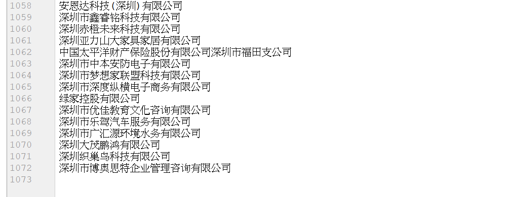
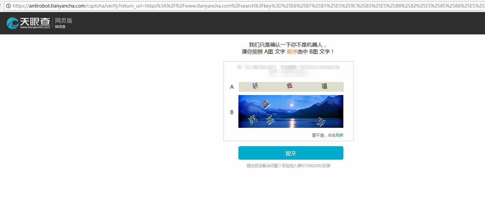
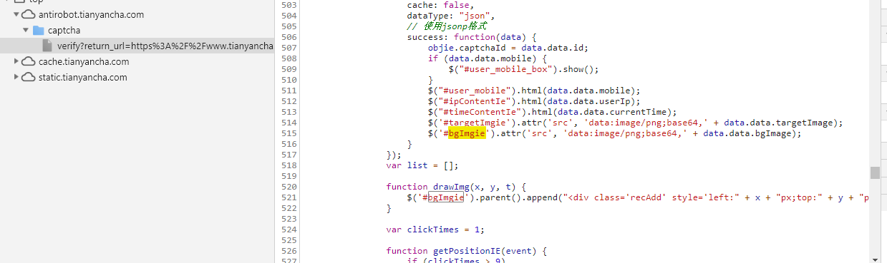
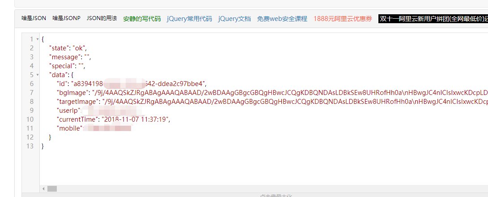
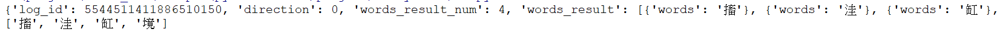

### 			爬取天眼查公司信息(验证码)

​	这个爬天眼查的项目，验证码的处理依赖百度OCR文本识别的api，亲测识别准确率不是很高，这个项目只能算是一个半成品。能力还达不到自己通过机器学习训练数据，来处理验证码，所以今天只是来记录一下我破解验证码的这个过程。

​	先在智联上爬取了1000多个公司的名称。

```python
import requests
import json

companies = {}
with open('companies.txt', 'a',encoding='utf-8')as f:
    for i in range(20):
        url = "https://fe-api.zhaopin.com/c/i/sou?start={}&pageSize=100&cityId=765&" \
              "workExperience=-1&education=-1&companyType=-1&employmentType=-1&jobWelfareTag=-1&" \
              "kt=3&lastUrlQuery=%7B%22jl%22:%22765%22%7D&rt=cc975bed189c4e74bf42bc2b2598f9a4&_v=0.11068914&" \
              "x-zp-page-request-id=35fe189bf071495ca40a8abfde61a72c-1541040183290-173141".format(str(i*100))
        r = requests.get(url)
        datas = json.loads(r.text)

        for data in datas['data']['results']:
            company = data['company']['name']
            if not companies.get(company, None):
                companies[company] = 1
                f.write(company + '\n')
                f.flush()
        print('-------第{}页------'.format(i+1))
```



​	然后新建一个settings文件，通过浏览器抓包，把headers，cookies，Proxy_Pool，User_Agent_Pool写入进来。cookies包含的信息太多，就不放上来了。

**settings.py**

```python
Proxy_Pool = [{'HTTPS': 'http://131.108.62.156:35172'}, {'HTTPS': 'http://197.255.41.103:53281'},
              {'HTTP': 'http://180.109.24.18:8888'}, {'HTTPS': 'http://202.21.107.154:30557'},
              {'HTTPS': 'http://103.117.23.71:35143'}, {'HTTPS': 'http://138.97.146.166:55960'},
              {'HTTPS': 'http://103.220.31.183:31917'}, {'HTTPS': 'http://103.237.175.66:51695'},
              {'HTTP': 'http://175.175.62.135:80'}, {'HTTPS': 'http://103.220.31.176:45088'},
              {'HTTPS': 'http://103.93.178.51:32311'}, {'HTTPS': 'http://167.249.169.90:34131'},
              {'HTTPS': 'http://103.243.7.61:55486'}, {'HTTPS': 'http://168.197.114.251:43308'},
              {'HTTPS': 'http://138.97.146.208:43506'}, {'HTTP': 'http://42.48.118.106:40319'},
              {'HTTPS': 'http://138.97.200.231:60958'}, {'HTTP': 'http://171.35.67.147:8118'},
              {'HTTP': 'http://119.23.224.100:80'}, {'HTTPS': 'http://103.230.62.194:55447'},
              {'HTTPS': 'http://138.97.147.201:52808'}, {'HTTPS': 'http://103.106.58.121:38753'},
              {'HTTP': 'http://115.223.250.202:8060'}, {'HTTPS': 'http://103.65.193.21:47049'},
              {'HTTPS': 'http://138.219.160.53:37305'}, {'HTTPS': 'http://185.41.215.81:45523'},
              {'HTTP': 'http://182.113.103.213:8060'}]

User_Agent_Pool = [
    'Mozilla/5.0 (Windows NT 6.1; WOW64) AppleWebKit/535.1 (KHTML, like Gecko) Chrome/14.0.835.163 Safari/535.1',
    'Mozilla/5.0 (Windows NT 6.1; WOW64; rv:6.0) Gecko/20100101 Firefox/6.0',
    'Mozilla/5.0 (Windows NT 6.1; WOW64) AppleWebKit/534.50 (KHTML, like Gecko) Version/5.1 Safari/534.50',
    'Opera/9.80 (Windows NT 6.1; U; zh-cn) Presto/2.9.168 Version/11.50',
    'Mozilla/5.0 (compatible; MSIE 9.0; Windows NT 6.1; Win64; x64; Trident/5.0; .NET CLR 2.0.50727; SLCC2; .NET CLR 3.5.30729; .NET CLR 3.0.30729; Media Center PC 6.0; InfoPath.3; .NET4.0C; Tablet PC 2.0; .NET4.0E)',
    'Mozilla/4.0 (compatible; MSIE 8.0; Windows NT 6.1; WOW64; Trident/4.0; SLCC2; .NET CLR 2.0.50727; .NET CLR 3.5.30729; .NET CLR 3.0.30729; Media Center PC 6.0; .NET4.0C; InfoPath.3)',
    'Mozilla/4.0 (compatible; MSIE 8.0; Windows NT 5.1; Trident/4.0; GTB7.0)',
    'Mozilla/4.0 (compatible; MSIE 7.0; Windows NT 5.1)',
    'Mozilla/4.0 (compatible; MSIE 6.0; Windows NT 5.1; SV1)',
    'Mozilla/5.0 (Windows; U; Windows NT 6.1; ) AppleWebKit/534.12 (KHTML, like Gecko) Maxthon/3.0 Safari/534.12',
    'Mozilla/4.0 (compatible; MSIE 7.0; Windows NT 6.1; WOW64; Trident/5.0; SLCC2; .NET CLR 2.0.50727; .NET CLR 3.5.30729; .NET CLR 3.0.30729; Media Center PC 6.0; InfoPath.3; .NET4.0C; .NET4.0E)',
    'Mozilla/4.0 (compatible; MSIE 7.0; Windows NT 6.1; WOW64; Trident/5.0; SLCC2; .NET CLR 2.0.50727; .NET CLR 3.5.30729; .NET CLR 3.0.30729; Media Center PC 6.0; InfoPath.3; .NET4.0C; .NET4.0E; SE 2.X MetaSr 1.0)',
    'Mozilla/5.0 (Windows; U; Windows NT 6.1; en-US) AppleWebKit/534.3 (KHTML, like Gecko) Chrome/6.0.472.33 Safari/534.3 SE 2.X MetaSr 1.0',
    'Mozilla/5.0 (compatible; MSIE 9.0; Windows NT 6.1; WOW64; Trident/5.0; SLCC2; .NET CLR 2.0.50727; .NET CLR 3.5.30729; .NET CLR 3.0.30729; Media Center PC 6.0; InfoPath.3; .NET4.0C; .NET4.0E)',
    'Mozilla/5.0 (Windows NT 6.1) AppleWebKit/535.1 (KHTML, like Gecko) Chrome/13.0.782.41 Safari/535.1 QQBrowser/6.9.11079.201',
    'Mozilla/4.0 (compatible; MSIE 7.0; Windows NT 6.1; WOW64; Trident/5.0; SLCC2; .NET CLR 2.0.50727; .NET CLR 3.5.30729; .NET CLR 3.0.30729; Media Center PC 6.0; InfoPath.3; .NET4.0C; .NET4.0E) QQBrowser/6.9.11079.201',
    'Mozilla/5.0 (compatible; MSIE 9.0; Windows NT 6.1; WOW64; Trident/5.0)',
]

Cookies = {
    你的cookies
}

Headers = {
    'Accept': 'text/html,application/xhtml+xml,application/xml;q=0.9,image/webp,image/apng,*/*;q=0.8',
    'Accept-Encoding': 'gzip, deflate, br',
    'Accept-Language': 'zh,en-US;q=0.9,en;q=0.8,zh-TW;q=0.7,zh-CN;q=0.6',
    'Cache-Control': 'no-cache',
    'Connection': 'keep-alive',
    'Host': 'www.tianyancha.com',
    'Pragma': 'no-cache',
    'Upgrade-Insecure-Requests': '1',
    'User-Agent': 'Mozilla/5.0 (Windows NT 10.0; Win64; x64) AppleWebKit/537.36 (KHTML, like Gecko) Chrome/67.0.3396.87 Safari/537.36',
}
```

​	然后再用xpath解析一下天眼查的页面，写个爬虫文件。

```python
import requests
import random
import time
from lxml import etree
from settings import *
from captcha import checkCaptcha


def start_parse():
    with open("companies.txt", 'r', encoding='utf-8') as f:
        while True:
            if not f.readline():
                break
            company = f.readline().replace("\n", "")
            url = "https://www.tianyancha.com/search?key=" + company
            Headers['User-Agent'] = random.choice(User_Agent_Pool)
            proxies = random.choice(Proxy_Pool)
            try:
                parse_company(url, proxies, Headers)
            except Exception as e:
                print('Error:{}'.format(e))


def parse_company(url, proxies, Headers):
    r = requests.get(url, headers=Headers, cookies=Cookies, proxies=proxies, verify=False)
    html = etree.HTML(r.text)

    datas = html.xpath('//div[@class="search-item"]')
    with open("company_info.txt", 'a', encoding='utf-8')as f:
        for data in datas:
            company_name = ''.join(data.xpath('.//div[@class="header"]/a//text()'))
            company_leader = ''.join(data.xpath('.//div[@class="info"]/div[1]/a/text()'))
            registe_money = ''.join(data.xpath('.//div[@class="info"]/div[2]/span/text()'))
            registe_date = ''.join(data.xpath('.//div[@class="info"]/div[3]/span/text()'))
            tel = ' | '.join(data.xpath('.//div[@class="contact"]/div[1]/span[2]/text()'))
            email = ''.join(data.xpath('.//div[@class="contact"]/div[2]/span[2]/text()'))
            score = data.xpath('.//div[@class="score"]/span[1]/text()')[0]
            line = company_name + '\t' + score + '\n' + '法人代表:' + company_leader + '\t' + '注册资本:' \
                   + registe_money + '\t' + '注册时间:' + registe_date + '\n' + '联系方式:' \
                   + tel + '\t' + '邮箱:' + email + '\n'
            print(line)
            f.write(line)
            f.flush()
    time.sleep(random.random() * random.randint(3, 10))


if __name__ == '__main__':
    start_parse()
```

​	我们发现，刚开始爬取的时候是不会要你验证验证码的，大概爬了400多个公司之后，会跳到一个验证的页面。



​	首先我们的思路是把这两张图片下载下来，通过文本识别，获取文字和坐标。但是这里有个坑，我们通过F12去审查元素，发现是可以获取图片的src的。但是我们通过脚本用xpath匹配的时候发现，没有数据，这是为什么呢？

​	这个属性是不是通过js去生成的呢，老思路，复制img的id，在浏览器的**Source**中去找哪个文件有这个id，很容易就找到了。



​	这个两个图片的src属性，是ajax请求http://antirobot.tianyancha.com/captcha/getCaptcha.json?t=成功之后，拼接而成的。

​	我们去请求一下这个地址，看看返回的是什么数据。



​	我们新建一个captcha.py文件，先写一个保存验证码图片的方法。通过json解析，获取验证码id，拼接验证码url。

**captcha.py**

```python
# 保存验证码图片
def get_verify_img():
    url = "http://antirobot.tianyancha.com/captcha/getCaptcha.json?t="
    r = requests.get(url)
    img_a_url = 'data:image/png;base64,' + json.loads(r.text)['data']['targetImage']
    img_b_url = 'data:image/png;base64,' + json.loads(r.text)['data']['bgImage']
    # 验证码id
    captchaId = json.loads(r.text)['data']['id']
    with open('a.png', 'wb')as f:
        r = urlopen(img_a_url)
        f.write(r.read())
    with open('b.png', 'wb')as f:
        r = urlopen(img_b_url)
        f.write(r.read())
    return captchaId
```

​	然后，我们用fiddler抓包，点击验证码，看它把数据提交到哪里，最好用fiddler，因为这里有个小坑，验证之后会二次跳转，浏览器上这个提交的链接就看不到了。

​	我们发现数据是通过get请求提交到https://antirobot.tianyancha.com/captcha/checkCaptcha.json?，经测试有两个必填参数验证码id，鼠标点击的坐标，还有两个时间戳的参数可以不用填。

​	验证失败，返回

```json
{"state":"fail","message":"","special":"","data":null}
```

​	验证成功，返回

```json

```

​	我就只要判断state就可以知道验证是否成功了。如果没有验证成功，则再次请求验证。

​	验证码文字的坐标信息，我们要借助百度OCR的文本识别功能来实现。在百度云上新建应用，获取appID之类就不说了，`pip install baidu-aip`安装一下依赖包。把你的百度OCR信息写到settings.py文件。

```python
# 百度ocr配置
APP_ID = '你的APP_ID'
API_KEY = '你的API_KEY'
SECRET_KEY = '你的SECRET_KEY'
```

​	然后开始解析本地的验证码图片。

```python
# 读取图片
def get_file_content(filePath):
    with open(filePath, 'rb') as fp:
        return fp.read()


# 解析验证码
def parse_captcha():
    client = AipOcr(APP_ID, API_KEY, SECRET_KEY)
    image_a = get_file_content('a.png')
    image_b = get_file_content('b.png')
    options = {}
    options["detect_direction"] = "true"
    # 高精度版会准确一点
    img_a_datas = client.basicAccurate(image_a, options)
    # img_b需要坐标信息
    img_b_datas = client.general(image_b)
    # 图片A中的文字
    a_words = [i['words'] for i in img_a_datas['words_result']]
    print(a_words)
    # 所有图片B的文字及坐标
    b_words = {}
    for word in img_b_datas['words_result']:
        key = word['words']
        value_x = word['location']['left']
        value_y = word['location']['top']
        b_words[key] = {'x': value_x, 'y': value_y}
    print(b_words)
    # 验证码的坐标
    clickLocs = []
    for i in a_words:
        for k, v in b_words.items():
            if i == k:
                clickLocs.append(v)
    print(clickLocs)
    return clickLocs
```

​	干扰项比较少，百度的接口还是可以准确识别的，干扰比较多就比较难识别了。

​	



​	获取到验证码坐标之后，再进行验证。

```python
# 验证验证码
def checkCaptcha():
    captchaId = get_verify_img()
    clickLocs = parse_captcha()
    url = "https://antirobot.tianyancha.com/captcha/checkCaptcha.json?" \
          "captchaId={}&clickLocs={}".format(captchaId, clickLocs)
    r = requests.get(url)
    if r.status_code == 200:
        state = json.loads(r.text)['state']
        # {"state":"ok","message":"","special":"","data":null}
        if state == 'ok':
            # 验证成功
            return 1
    time.sleep(3)
    # 验证失败或者请求失败
    checkCaptcha()
```

​	然后每次爬取页面信息的时候判断一下页面title信息就可以了，完整代码如下。

**settings.py**

```python
Proxy_Pool = [{'HTTPS': 'http://131.108.62.156:35172'}, {'HTTPS': 'http://197.255.41.103:53281'},
              {'HTTP': 'http://180.109.24.18:8888'}, {'HTTPS': 'http://202.21.107.154:30557'},
              {'HTTPS': 'http://103.117.23.71:35143'}, {'HTTPS': 'http://138.97.146.166:55960'},
              {'HTTPS': 'http://103.220.31.183:31917'}, {'HTTPS': 'http://103.237.175.66:51695'},
              {'HTTP': 'http://175.175.62.135:80'}, {'HTTPS': 'http://103.220.31.176:45088'},
              {'HTTPS': 'http://103.93.178.51:32311'}, {'HTTPS': 'http://167.249.169.90:34131'},
              {'HTTPS': 'http://103.243.7.61:55486'}, {'HTTPS': 'http://168.197.114.251:43308'},
              {'HTTPS': 'http://138.97.146.208:43506'}, {'HTTP': 'http://42.48.118.106:40319'},
              {'HTTPS': 'http://138.97.200.231:60958'}, {'HTTP': 'http://171.35.67.147:8118'},
              {'HTTP': 'http://119.23.224.100:80'}, {'HTTPS': 'http://103.230.62.194:55447'},
              {'HTTPS': 'http://138.97.147.201:52808'}, {'HTTPS': 'http://103.106.58.121:38753'},
              {'HTTP': 'http://115.223.250.202:8060'}, {'HTTPS': 'http://103.65.193.21:47049'},
              {'HTTPS': 'http://138.219.160.53:37305'}, {'HTTPS': 'http://185.41.215.81:45523'},
              {'HTTP': 'http://182.113.103.213:8060'}]

User_Agent_Pool = [
    'Mozilla/5.0 (Windows NT 6.1; WOW64) AppleWebKit/535.1 (KHTML, like Gecko) Chrome/14.0.835.163 Safari/535.1',
    'Mozilla/5.0 (Windows NT 6.1; WOW64; rv:6.0) Gecko/20100101 Firefox/6.0',
    'Mozilla/5.0 (Windows NT 6.1; WOW64) AppleWebKit/534.50 (KHTML, like Gecko) Version/5.1 Safari/534.50',
    'Opera/9.80 (Windows NT 6.1; U; zh-cn) Presto/2.9.168 Version/11.50',
    'Mozilla/5.0 (compatible; MSIE 9.0; Windows NT 6.1; Win64; x64; Trident/5.0; .NET CLR 2.0.50727; SLCC2; .NET CLR 3.5.30729; .NET CLR 3.0.30729; Media Center PC 6.0; InfoPath.3; .NET4.0C; Tablet PC 2.0; .NET4.0E)',
    'Mozilla/4.0 (compatible; MSIE 8.0; Windows NT 6.1; WOW64; Trident/4.0; SLCC2; .NET CLR 2.0.50727; .NET CLR 3.5.30729; .NET CLR 3.0.30729; Media Center PC 6.0; .NET4.0C; InfoPath.3)',
    'Mozilla/4.0 (compatible; MSIE 8.0; Windows NT 5.1; Trident/4.0; GTB7.0)',
    'Mozilla/4.0 (compatible; MSIE 7.0; Windows NT 5.1)',
    'Mozilla/4.0 (compatible; MSIE 6.0; Windows NT 5.1; SV1)',
    'Mozilla/5.0 (Windows; U; Windows NT 6.1; ) AppleWebKit/534.12 (KHTML, like Gecko) Maxthon/3.0 Safari/534.12',
    'Mozilla/4.0 (compatible; MSIE 7.0; Windows NT 6.1; WOW64; Trident/5.0; SLCC2; .NET CLR 2.0.50727; .NET CLR 3.5.30729; .NET CLR 3.0.30729; Media Center PC 6.0; InfoPath.3; .NET4.0C; .NET4.0E)',
    'Mozilla/4.0 (compatible; MSIE 7.0; Windows NT 6.1; WOW64; Trident/5.0; SLCC2; .NET CLR 2.0.50727; .NET CLR 3.5.30729; .NET CLR 3.0.30729; Media Center PC 6.0; InfoPath.3; .NET4.0C; .NET4.0E; SE 2.X MetaSr 1.0)',
    'Mozilla/5.0 (Windows; U; Windows NT 6.1; en-US) AppleWebKit/534.3 (KHTML, like Gecko) Chrome/6.0.472.33 Safari/534.3 SE 2.X MetaSr 1.0',
    'Mozilla/5.0 (compatible; MSIE 9.0; Windows NT 6.1; WOW64; Trident/5.0; SLCC2; .NET CLR 2.0.50727; .NET CLR 3.5.30729; .NET CLR 3.0.30729; Media Center PC 6.0; InfoPath.3; .NET4.0C; .NET4.0E)',
    'Mozilla/5.0 (Windows NT 6.1) AppleWebKit/535.1 (KHTML, like Gecko) Chrome/13.0.782.41 Safari/535.1 QQBrowser/6.9.11079.201',
    'Mozilla/4.0 (compatible; MSIE 7.0; Windows NT 6.1; WOW64; Trident/5.0; SLCC2; .NET CLR 2.0.50727; .NET CLR 3.5.30729; .NET CLR 3.0.30729; Media Center PC 6.0; InfoPath.3; .NET4.0C; .NET4.0E) QQBrowser/6.9.11079.201',
    'Mozilla/5.0 (compatible; MSIE 9.0; Windows NT 6.1; WOW64; Trident/5.0)',
]

Cookies = {
    你的cookies
}

Headers = {
    'Accept': 'text/html,application/xhtml+xml,application/xml;q=0.9,image/webp,image/apng,*/*;q=0.8',
    'Accept-Encoding': 'gzip, deflate, br',
    'Accept-Language': 'zh,en-US;q=0.9,en;q=0.8,zh-TW;q=0.7,zh-CN;q=0.6',
    'Cache-Control': 'no-cache',
    'Connection': 'keep-alive',
    'Host': 'www.tianyancha.com',
    'Pragma': 'no-cache',
    'Upgrade-Insecure-Requests': '1',
    'User-Agent': 'Mozilla/5.0 (Windows NT 10.0; Win64; x64) AppleWebKit/537.36 (KHTML, like Gecko) Chrome/67.0.3396.87 Safari/537.36',
}

# 百度ocr配置
APP_ID = '你的APP_ID'
API_KEY = '你的API_KEY'
SECRET_KEY = '你的SECRET_KEY'
```

**tianyan.py**

```python
import requests
import random
import time
from lxml import etree
from settings import *
from captcha import checkCaptcha


def start_parse():
    with open("companies.txt", 'r', encoding='utf-8') as f:
        while True:
            if not f.readline():
                break
            company = f.readline().replace("\n", "")
            url = "https://www.tianyancha.com/search?key=" + company
            Headers['User-Agent'] = random.choice(User_Agent_Pool)
            proxies = random.choice(Proxy_Pool)
            try:
                parse_company(url, proxies, Headers)
            except Exception as e:
                print('Error:{}'.format(e))


def parse_company(url, proxies, Headers):
    r = requests.get(url, headers=Headers, cookies=Cookies, proxies=proxies, verify=False)
    html = etree.HTML(r.text)
    title = html.xpath("//title/text()")[0]
    if title == "天眼查校验":
        checkCaptcha()
    datas = html.xpath('//div[@class="search-item"]')
    with open("company_info.txt", 'a', encoding='utf-8')as f:
        for data in datas:
            company_name = ''.join(data.xpath('.//div[@class="header"]/a//text()'))
            company_leader = ''.join(data.xpath('.//div[@class="info"]/div[1]/a/text()'))
            registe_money = ''.join(data.xpath('.//div[@class="info"]/div[2]/span/text()'))
            registe_date = ''.join(data.xpath('.//div[@class="info"]/div[3]/span/text()'))
            tel = ' | '.join(data.xpath('.//div[@class="contact"]/div[1]/span[2]/text()'))
            email = ''.join(data.xpath('.//div[@class="contact"]/div[2]/span[2]/text()'))
            score = data.xpath('.//div[@class="score"]/span[1]/text()')[0]
            line = company_name + '\t' + score + '\n' + '法人代表:' + company_leader + '\t' + '注册资本:' \
                   + registe_money + '\t' + '注册时间:' + registe_date + '\n' + '联系方式:' \
                   + tel + '\t' + '邮箱:' + email + '\n'
            print(line)
            f.write(line)
            f.flush()
    time.sleep(random.random() * random.randint(3, 10))


if __name__ == '__main__':
    start_parse()

```

**captcha.py**

```python
import requests
import json
import time
from urllib.request import urlopen
from PIL import Image, ImageEnhance
from aip import AipOcr
from settings import *


# 保存验证码图片
def get_verify_img():
    url = "http://antirobot.tianyancha.com/captcha/getCaptcha.json?t="
    r = requests.get(url)
    img_a_url = 'data:image/png;base64,' + json.loads(r.text)['data']['targetImage']
    img_b_url = 'data:image/png;base64,' + json.loads(r.text)['data']['bgImage']
    # 验证码id
    captchaId = json.loads(r.text)['data']['id']
    with open('a.png', 'wb')as f:
        r = urlopen(img_a_url)
        f.write(r.read())
    with open('b.png', 'wb')as f:
        r = urlopen(img_b_url)
        f.write(r.read())
    return captchaId


# 验证验证码
def checkCaptcha():
    captchaId = get_verify_img()
    clickLocs = parse_captcha()
    url = "https://antirobot.tianyancha.com/captcha/checkCaptcha.json?" \
          "captchaId={}&clickLocs={}".format(captchaId, clickLocs)
    r = requests.get(url)
    if r.status_code == 200:
        state = json.loads(r.text)['state']
        # {"state":"ok","message":"","special":"","data":null}
        if state == 'ok':
            # 验证成功
            return 1
    time.sleep(3)
    # 验证失败或者请求失败
    checkCaptcha()


# 读取图片
def get_file_content(filePath):
    with open(filePath, 'rb') as fp:
        return fp.read()


# 解析验证码
def parse_captcha():
    client = AipOcr(APP_ID, API_KEY, SECRET_KEY)
    image_a = get_file_content('a.png')
    image_b = get_file_content('b.png')
    options = {}
    options["detect_direction"] = "true"
    # 高精度版会准确一点
    img_a_datas = client.basicAccurate(image_a, options)
    # img_b需要坐标信息
    img_b_datas = client.general(image_b)
    # 图片A中的文字
    a_words = [i['words'] for i in img_a_datas['words_result']]
    print(a_words)
    # 所有图片B的文字及坐标
    b_words = {}
    for word in img_b_datas['words_result']:
        key = word['words']
        value_x = word['location']['left']
        value_y = word['location']['top']
        b_words[key] = {'x': value_x, 'y': value_y}
    print(b_words)
    # 验证码的坐标
    clickLocs = []
    for i in a_words:
        for k, v in b_words.items():
            if i == k:
                clickLocs.append(v)
    print(clickLocs)
    return clickLocs


def enhance_img(imgPath):
    im = Image.open(imgPath)
    # 下面为增强部分
    enh_con = ImageEnhance.Contrast(im)
    contrast = 1.5
    image_contrasted = enh_con.enhance(contrast)
    # image_contrasted.show()

    # 增强亮度
    enh_bri = ImageEnhance.Brightness(image_contrasted)
    brightness = 1.5
    image_brightened = enh_bri.enhance(brightness)
    # image_brightened.show()
    # 增强对比度
    enh_col = ImageEnhance.Color(image_brightened)
    color = 1.5
    image_colored = enh_col.enhance(color)
    # image_colored.show()
    # 增强锐度
    enh_sha = ImageEnhance.Sharpness(image_colored)
    sharpness = 3.0
    image_sharped = enh_sha.enhance(sharpness)
    # image_sharped.show()

    # 灰度处理部分
    im2 = image_sharped.convert("L")
    return im2


if __name__ == '__main__':
    checkCaptcha()

```


​	


