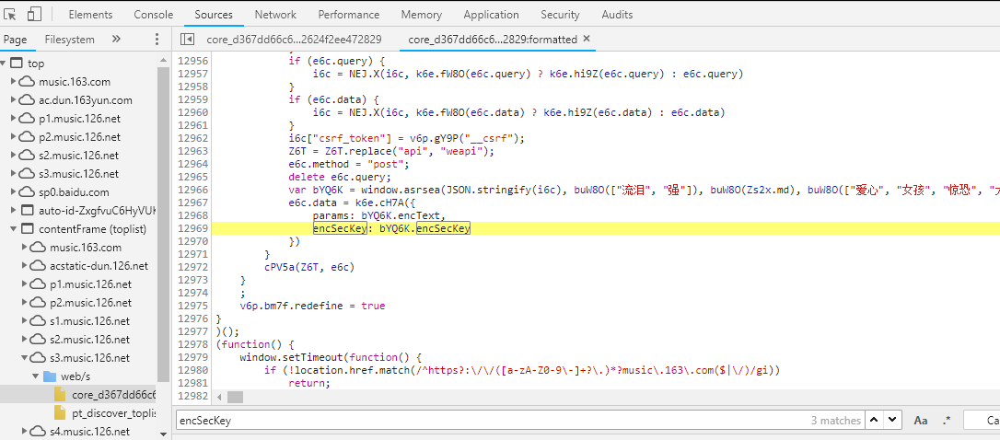

### 				网易云音乐爬虫

​	记一次爬取网易云音乐，解决js加密的全过程。用python的requests库保存音乐时，发现需要通过post请求提交加密参数才能获取到MP3的链接。

​	用chorme浏览器的F12调试功能，抓取请求。


​	发现浏览器向**https://music.163.com/weapi/song/enhance/player/url?csrf_token=** 发送了一次post请求，包含**params** 和**encSecKey** 两个参数。经过研究发现，参数是通过js加密的。

​	对于有js加密的反爬,我的思路一般有两种，比较简单的就是用**selenium + phantomjs**去模拟浏览器行为，这种方式比较简单，但是稳定性比较差，速度比较慢。第二种就是，去研究网站的js加密过程，我们不用去管他的加密是通过什么加密方式如何实现的，我们只需要通过浏览器断点调试的功能，找到加密的地方，调试输入输出。输出结果一致之后，通过python调用js，获取到加密后的参数就可以了。

​	知道这两个参数名，就去**Sources**里找相应的js文件，没找到特别好的方法，我只能用比较笨的方法一个文件一个文件的去搜索关键词。


​	这样看，不太好看，网站服务器上的静态资源一般都是被压缩过的，我们可以点一下左下角的**{}**  格式化一下js代码。



```js
var bYQ6K = window.asrsea(JSON.stringify(i6c)， buW8O(["流泪"， "强"])， buW8O(Zs2x.md)， buW8O(["爱心"， "女孩"， "惊恐"， "大笑"]));
            e6c.data = k6e.cH7A({
                params: bYQ6K.encText，
                encSecKey: bYQ6K.encSecKey
            })
```

​	**params**和**encSecKey**就是这段代码产生的，**bYQ6K**又调用了**window.asrsea**这个函数，继续往上看。

```js
!function () {
    function a(a) {
        var d, e, b = "abcdefghijklmnopqrstuvwxyzABCDEFGHIJKLMNOPQRSTUVWXYZ0123456789", c = "";
        for (d = 0; a > d; d += 1) e = Math.random() * b.length, e = Math.floor(e), c += b.charAt(e);
        return c
    }

    function b(a, b) {
        var c = CryptoJS.enc.Utf8.parse(b), d = CryptoJS.enc.Utf8.parse("0102030405060708"),
            e = CryptoJS.enc.Utf8.parse(a), f = CryptoJS.AES.encrypt(e, c, {iv: d, mode: CryptoJS.mode.CBC});
        return f.toString()
    }

    function c(a, b, c) {
        var d, e;
        return setMaxDigits(131), d = new RSAKeyPair(b, "", c), e = encryptedString(d, a)
    }

    function d(d, e, f, g) {
        var h = {}, i = a(16);
        return h.encText = b(d, g), h.encText = b(h.encText, i), h.encSecKey = c(i, e, f), h
    }

    function e(a, b, d, e) {
        var f = {};
        return f.encText = c(a + e, b, d), f
    }

    window.asrsea = d, window.ecnonasr = e
}();
```

​	这是个自运行的js函数了，**window.asrsea**就是d函数了，所以入口的参数就是d，e，f，g四个参数了，如果知道这四个参数是啥，问题基本上就解决了。

​	**fiddler**是个好东西，除了抓包，还可以把本地的Js代码，放到线上调试，用浏览器dbug虽然比较方便，但是不能改动js文件，输出变量啥的不太方便。

​	首先，我们要把服务器上的那个js文件保存到本地，改写Js文件，打印输入输出的值。然后下载fiddler，进行配置。

```javascript
function d(d, e, f, g) {
        var h = {}, i = a(16);
        console.log('参数',d,e,f,g);
        console.log('parms',b(b(d, g), i));
        console.log('encSecKey',c(i, e, f));
        return h.encText = b(d, g), h.encText = b(h.encText, i), h.encSecKey = c(i, e, f), h
    }
```


​	fiddler设置啥的就不说了，百度上很多。配置好了，浏览器上输入url，开始抓包，找到之前那个js文件。


​	然后把这个请求拖到右边的AutoResponder，设置本地js文件路径和服务器上js文件路径。


​	设置好了以后，清除浏览器缓存，然后F12抓包，看一下Sources里的Js文件，如果已经变成我们本地的Js文件，说明设置没问题了，然后我们点击播放再调到控制台看一下输出。

​	发现这个函数有很多地方都被调用过，但是我们只想要设置parms和encSecKey的那一条，我们找到Network里面请求发送的数据，复制过来找到匹配的那一条。


​	研究之后，我们会发现d函数的4个参数，后面三个都是固定值，只有d传递了跟歌曲相关的参数。

```python
d:{"ids":"[28912248]","br":128000,"csrf_token":""}
e:'010001'
f:'00e0b509f6259df8642dbc35662901477df22677ec152b5ff68ace615bb7b725152b3ab17a876aea8a5aa76d2e417629ec4ee341f56135fccf695280104e0312ecbda92557c93870114af6c9d05c4f7f0c3685b7a46bee255932575cce10b424d813cfe4875d3e82047b97ddef52741d546b8e289dc6935b3ece0462db0a22b8e7'
g:'0CoJUm6Qyw8W8jud'
```

​	剩下就是调试了，改写Js代码，传入歌曲id之后，返回值如果匹配，再到用PyExecJS调用js代码获取params和encSecKey就可以了。

​	经过调试发现d,e传入的参数必须为字符串类型，不能是字典和整数。

​	改写js还是花了我蛮多时间，通过PyExecJS执行js时，老是会报对象没有定义的错误。我们除了需要把a,b,c,d,e这几个函数复制过去以外,还要CryptoJS相关以及这几个函数相关的函数全部复制过去，总共700多行。


​	然后我们在python脚本里测试一下，看一下是否能够获取歌曲的真实url，先定义一个get_song函数

```python
def get_song(params, encSecKey):
    url = 'https://music.163.com/weapi/song/enhance/player/url?csrf_token='
    data = {
        'params': params,
        'encSecKey': encSecKey
    }
    r = requests.post(url, headers=HEADERS, cookies=COOKIES, data=data)
    print(r.status_code)
    print(r.text)
```

​	然后再进行测试。

```python
if __name__ == '__main__':
    song_id = '28912248'
    d = '{"ids":"[%s]","br":128000,"csrf_token":""}' % song_id
    e = '010001'
    f = '00e0b509f6259df8642dbc35662901477df22677ec152b5ff68ace615bb7b725152b3ab17a876aea8a5aa76d2e417629ec4ee341f56135fccf695280104e0312ecbda92557c93870114af6c9d05c4f7f0c3685b7a46bee255932575cce10b424d813cfe4875d3e82047b97ddef52741d546b8e289dc6935b3ece0462db0a22b8e7'
    g = '0CoJUm6Qyw8W8jud'

    js = open('wyy.js').read()
    res = execjs.compile(js).call('d', d, e, f, g)
    params = res.get('encText', None)
    encSecKey = res.get('encSecKey', None)
    print(params)
    print(encSecKey)

    print('=========================')
    get_song(params,encSecKey)
```

​	查看结果，说明没问题，然后我们再把代码优化一下就可以了。


​	

​	这个下载的是飙升榜前20首的，基本上没啥大问题了。最后有个小坑说一下，网易云的歌曲链接，都会在中间加一个**/#**，比如这样的https://music.163.com/#/discover/toplist，通过这个链接我们是没有办法通过xpath获取节点的，需要我们把链接处理一下，去掉中间的**/#**

 	  以下是源码，**仅用于学习交流，他用概不负责哈**。

```python
import requests
from lxml import etree
import execjs
import json

HEADERS = {
    'Connection': 'keep-alive',
    'User-Agent': 'Mozilla/5.0 (Windows NT 10.0; Win64; x64) AppleWebKit/537.36 (KHTML, like Gecko) Chrome/67.0.3396.87 Safari/537.36',
    'Accept': 'text/html,application/xhtml+xml,application/xml;q=0.9,image/webp,image/apng,*/*;q=0.8',
    'Accept-Encoding': 'gzip, deflate, br',
    'Accept-Language': 'zh,en-US;q=0.9,en;q=0.8,zh-TW;q=0.7,zh-CN;q=0.6',
}

COOKIES = {
    '_ntes_nnid': 'ec120dab4cb75d32efff994a79761982,1526465501219',
    '_ntes_nuid': 'ec120dab4cb75d32efff994a79761982',
    'WM_TID': 'FZLkww%2BCjeG4zs6k2JRBmorJ7LyK3ktq',
    '_iuqxldmzr_': '32',
    'usertrack=': 'ezq0pVsqGVWv6TU2BFkRAg==',
    '_ga': 'GA1.2.2011309267.1529485656',
    '__utmz': '94650624.1535794588.26.16.utmcsr=baidu|utmccn=(organic)|utmcmd=organic',
    '__f_': '1536572085949',
    'vjuids': '51bf42042.165d5f2775c.0.2dd86b31833e8',
    'vjlast': '1536892762.1536892762.30',
    'vinfo_n_f_l_n3': 'd15e8dcff4df30ec.1.0.1536892762205.0.1536892772593',
    '__utma': '94650624.134579790.1527819164.1535794588.1537866440.27',
    '__utmc': '94650624',
    'JSESSIONID-WYYY': 'GNseqDz94UVvaXcD70NhuKMYy2gYf7%5CcRJoSzptRw%2FGjDuSCoIsICwCEVZQD%2Fvrx0WTSzJu8utkcGkfiZZeizvHBdOgog4%5CtlJgO2gRqXep5hhIDbF1AH%2FCDj7apCp2pJfjgVSn3kXNY64yHb0uv9ba5wvzmGYFz2e%2FXfucKQEl7%2F5ed%3A1537869978586',
    '__utmb': '94650624.24.10.1537866440',
    'WM_NI': 'oAaUCJKpN2KFBbJ%2FQW6BkPhOtqtc2DszhZ0v7CICUV%2FXqY31VQayVGucQ%2FPP3nR%2FDjPLPVJ%2BEzF8ZJD8WGG1QDcfjIzOGYLO%2FcBOBWx7xQtxpWRmQnEMxJHuHTjEivJjQVk%3D',
    'WM_NIKE': '9ca17ae2e6ffcda170e2e6eea2e47f83f0bba8f33bacb88bb2d14e939e9b84ee6e87bd8ea4db70bbeeb9d3c52af0fea7c3b92aad9fafb6c24289b082d3ca4e82be86d0d45df69ea5b1eb45b8afbc84b150b1a6a8bbb37ef59d87a4d85eed88bfbab23b968faf9ad54db7bd9fd0d35cf1b29ed0c7629494a0b7c92187a68ad9d94288e899a8c63b939cad87e943ba9189bacf45edbd8eb0c15dbce9b8b2f774b4899e8ed4668793b8abcb7f8c8ca6a6ec7e8ab69fb7ea37e2a3',
}


def parse_songs(url):
    r = requests.get(url, headers=HEADERS, cookies=COOKIES)
    html = etree.HTML(r.text)
    datas = html.xpath("//ul[@class='f-hide']/li/a")[:20]
    for data in datas:
        try:
            song_id = data.xpath("./@href")[0].split('=')[-1]
            song_name = data.xpath("./text()")[0]
            params, encSecKey = get_params_encSecKey(song_id)
            real_url = get_song(params, encSecKey)
            save_songs(real_url, song_name)
        except:
            pass


def get_params_encSecKey(song_id):
    d = '{"ids":"[%s]","br":128000,"csrf_token":""}' % song_id
    e = '010001'
    f = '00e0b509f6259df8642dbc35662901477df22677ec152b5ff68ace615bb7b725152b3ab17a876aea8a5aa76d2e417629ec4ee341f56135fccf695280104e0312ecbda92557c93870114af6c9d05c4f7f0c3685b7a46bee255932575cce10b424d813cfe4875d3e82047b97ddef52741d546b8e289dc6935b3ece0462db0a22b8e7'
    g = '0CoJUm6Qyw8W8jud'
    js = open('wyy.js').read()
    res = execjs.compile(js).call('d', d, e, f, g)
    params = res.get('encText', None)
    encSecKey = res.get('encSecKey', None)
    return params, encSecKey


def save_songs(song_url, song_name):
    r = requests.get(song_url)
    with open('music/%s.mp3' % song_name, 'wb')as f:
        f.write(r.content)
    print('------%s  下载完成-------' % song_name)


def get_song(params, encSecKey):
    url = 'https://music.163.com/weapi/song/enhance/player/url?csrf_token='
    data = {
        'params': params,
        'encSecKey': encSecKey
    }
    r = requests.post(url, headers=HEADERS, cookies=COOKIES, data=data)
    song_url = json.loads(r.text)['data'][0]['url']
    return song_url


if __name__ == '__main__':
    top_url = 'https://music.163.com/discover/toplist'
    parse_songs(top_url)
```


