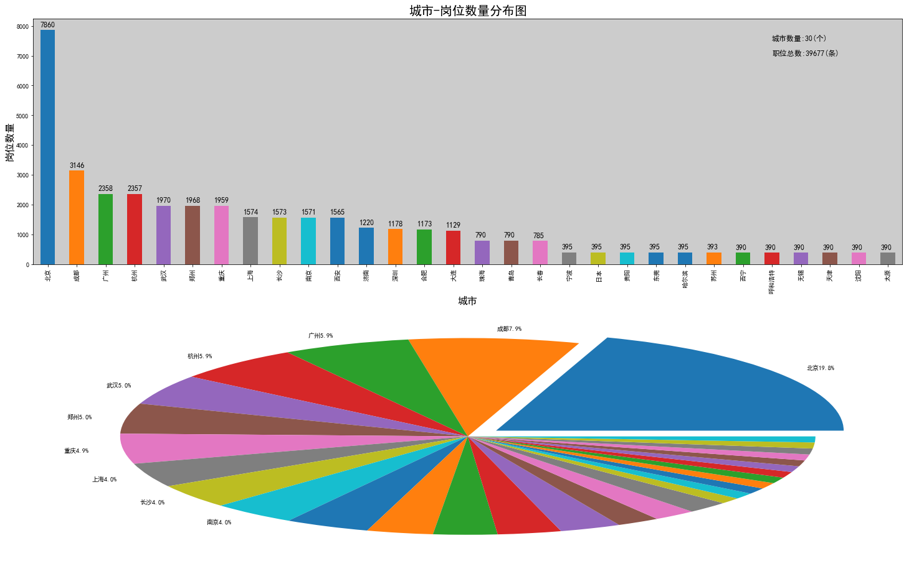

​	这个项目是先对智联招聘网站的岗位信息通过爬虫进行获取，并保存excel，然后用jupyter对岗位数据进行清洗，分析，可视化处理。

​	主要是用到了pandas对数据处理，用matplotlib画图。其中在画图的时候，碰到一个问题，中文不显示，需要我们手动设置一下字体，以雅黑为例。

```python
from pylab import mpl 
mpl.rcParams['font.sans-serif']=['SimHei']
```

​	



