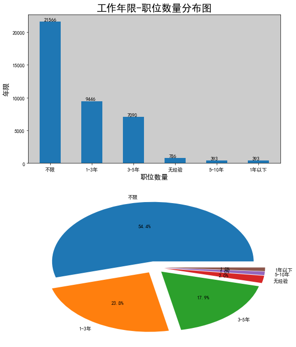
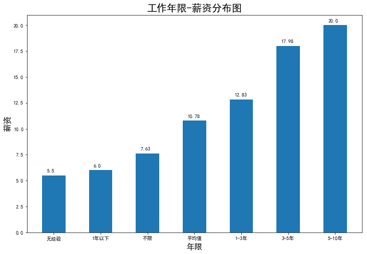
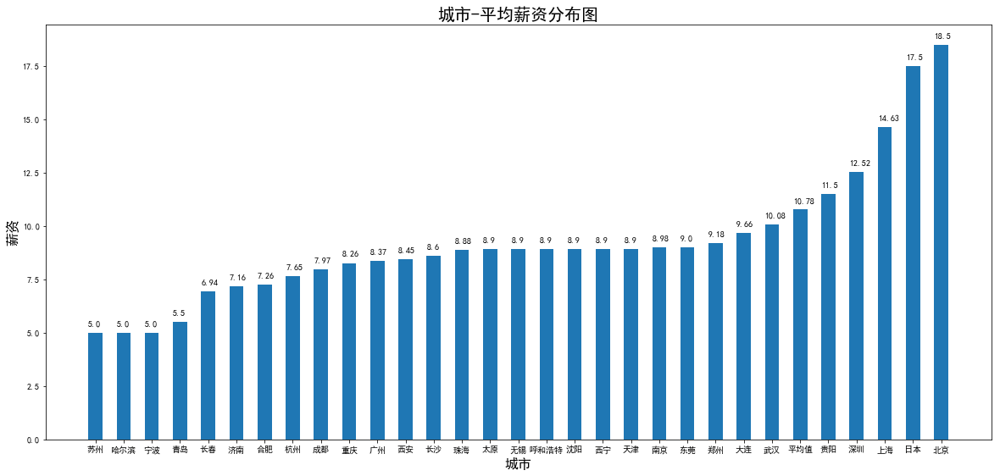

​	这个项目是先对智联招聘网站的**python**岗位信息通过爬虫进行获取，并保存excel，然后用jupyter对岗位数据进行清洗，分析，可视化处理。

​	主要是用到了pandas对数据处理，用matplotlib画图。其中在画图的时候，碰到一个问题，中文不显示，需要我们手动设置一下字体，以雅黑为例。

```python
from pylab import mpl 
mpl.rcParams['font.sans-serif']=['SimHei']
```

​	通过对城市和岗位两个维度进行分析，发现数据和我们想象的有点差距，北京的python岗位19.8%，全国最多。但是深圳的岗位数量居然排不进前10，确实有点意外。可能各个地区，招聘网站使用的有所不同，暂时没有办法解释，需要再爬一下前程无忧的数据进行对比。








